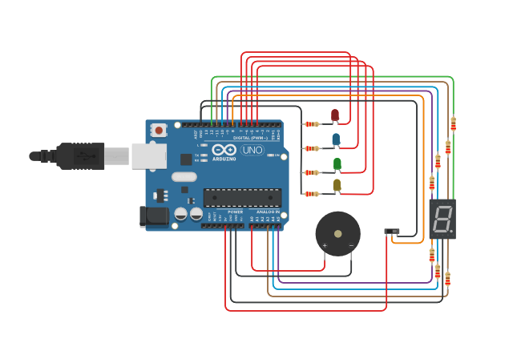

# Proyecto Estaciones de Subte

## Materia:
- Sistemas de Procesamiento de Datos

## Profesor:
- Darío Cuda
## Tutor:
- Estaben Quiroz

## Integrante 
- Ángel Fabián Cabello

## Proyecto: Estaciones de Subte

## Descripción
El presente modelo de Arduino simula la llegada de una formación de subte a cuatro estaciones consecutivas de la linea C, en el siguiente orden: Moreno, Independiencia, San Juan y Constitución. Entonces, al iniciar la simulación, el subte comienza su recorrido en la estación de Moreno, se enciende un led, el display de 7 segmentos indica el número de estaciones faltantes para llegar a destino y suena el zumbador a modo de sirena de aviso. Luego este ciclo se repite indicando el avance el subte a través de las estaciones.

## Función principal
Esta funcion se encarga de encender y apagar los leds.

B0, B1, B2, B3 son #define que utilizamos para agregar los leds, asociandolo a pines de la placa arduino.

(Breve explicación de la función)

~~~ C (lenguaje en el que esta escrito)
void EncenderBinario(int estado3, int estado2,int estado1,int estado0)
{
  digitalWrite(B3,estado3);
  digitalWrite(B2,estado2);
  digitalWrite(B1,estado1);
  digitalWrite(B0,estado0);
}
~~~

## :robot: Link al proyecto
- [proyecto](https://www.tinkercad.com/things/hq86m6GMRpG)
## :tv: Link al video del proceso
- [video](N/A)

---
### Fuentes
- [Consejos para documentar](https://www.sohamkamani.com/how-to-write-good-documentation/#architecture-documentation).

- [Lenguaje Markdown](https://markdown.es/sintaxis-markdown/#linkauto).

- [Markdown Cheatsheet](https://github.com/adam-p/markdown-here/wiki/Markdown-Cheatsheet).

- [Tutorial](https://www.youtube.com/watch?v=oxaH9CFpeEE).

- [Emojis](https://gist.github.com/rxaviers/7360908).

---

